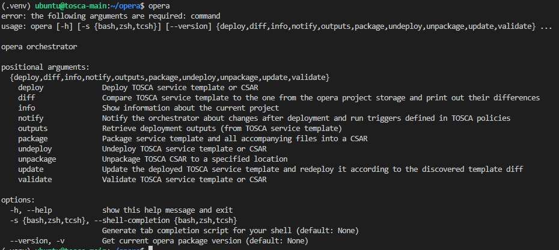

# TOSCA-basic-workshop

## Environment
### Two VMs
1. TOSCA-main 	
    * __Purpose__: This is my local machine. From here I will be orchestrating my service blueprint.
    * IP: 172.17.91.243
    * OS: ubuntu 
    * python v3.10
2. TOSCA-target 
    * __Purpose__: This is my remote/target machine. I will deploy all the services (e.g. docker engine, and some other containerized apps) atop this machine/VM.
    * IP: 172.17.91.243
    * OS: ubuntu 
3. Note down the key file.
    * lets keep the key file in __/home/ubuntu/.ssh/__ folder.
    * For me, the key file name is *chinmayadehury* 
4. Make sure that you can login to __TOSCA-target__ VM from the local machine (e.g. from __TOSCA-main__)
    * using follwing command you should be able to login to your remote machine
    ```ssh -i /home/ubuntu/.ssh/chinmayadehury ubuntu@172.17.91.243```
        * update __/home/ubuntu/.ssh/chinmayadehury__ as per your system
        * update __172.17.91.243__ as per your system
        * you may also update the username __ubuntu__, if required.
5. Install ```git```, if it is not present

## S1. Installation of xOpera
xOpera is distributed as a Python package that is regularly published on PyPI. So the simplest way to test opera is to install it into a virtual environment. 

* Login to ```TOSCA-main``` VM
* Update ubuntu: ```sudo apt update```
* Create and change directory to a new opera directory: ```mkdir $HOME/opera && cd $HOME/opera```
* Install python virtual environment if not present ```sudo apt install python3-venv python3-wheel python-wheel-common```
* Create a virtual environment: ```python3 -m venv .venv```
* Activate the virtual environment:  ```. .venv/bin/activate```
* Install pip : ```pip install pip==21.3.1``` 
* Now it is the time to install opera: ```pip install opera==0.6.8```
    * this demo might not work with the latest version of opera (i.e. 0.7.0)
* If you receive some errors or warnings related to ```pyyaml``` versions, please ignore them.
* Check the installation by only issuing opera command


#### _Note_: 
Remember that opera requires python 3 and a virtual environment. Before you issue any opera command, make sure that you have activated the virtual environment.
```
cd $HOME/opera
. .venv/bin/activate
opera
```

## S2. Deployment
* Make sure you are inside local machine ```TOSCA-main```
* Activate the virtual environment, if not, using following command:
    ```
        cd $HOME/opera
        . .venv/bin/activate
    ```
* Come out of ```opera``` directory using ```cd ..``` command. 
* Clone the https://github.com/TOSCA-ML/TOSCA-basic-workshop repository
```git clone https://github.com/TOSCA-ML/TOSCA-basic-workshop```
* ```cd TOSCA-basic-workshop```
* Open ```service.yaml``` file. Update the following and save:
    * Update the following propertise of ```RemoteWorkstation_VM``` node
        * ```ssh_username```,  ```KeyFile```, and ```external_ip```
    * Similar to above update the properties of ```containerNginx```, ```containerHttp```, ```myWhiteboard```, ```myminio```, and ```mygrafana``` nodes.
    * If you dont need any node (except ```RemoteWorkstation_VM``` and ```containerNginx```), please command that section in ```service.yaml``` file. 
    * No need to udpate the ```DockerEngine``` node. Leave it to default.
* Now it's time to deploy the service blueprint using the command ```opera deploy -c service.yaml```.

<!-- ## S2. Get the TOSCA definitions
* Login to ```TOSCA-main``` VM
* Make sure you have activated the virtual environment.
* cd $HOME
* Fork https://gitlab.cs.ut.ee/devops22fallpub/radon-particles repository ```git clone https://gitlab.cs.ut.ee/devops22fallpub/radon-particles``` -->


## References :
- xOpera Github repo: https://github.com/xlab-si/xopera-opera 
- xOpera documentation is available here: https://xlab-si.github.io/xopera-docs/index.html 
- Cli command references: https://xlab-si.github.io/xopera-docs/02-cli.html#cli-commands-reference 
